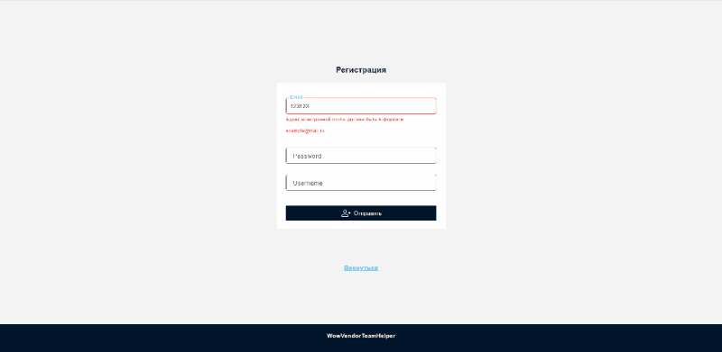
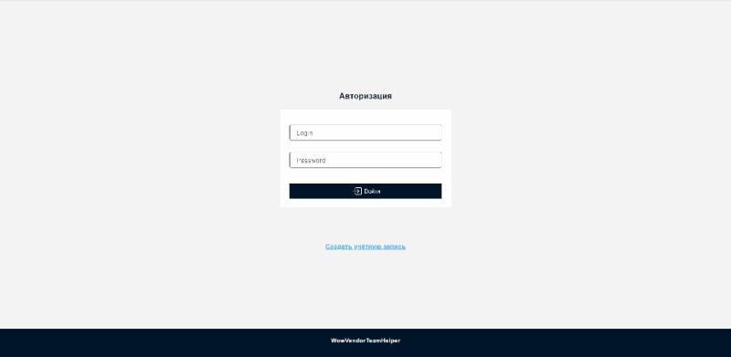
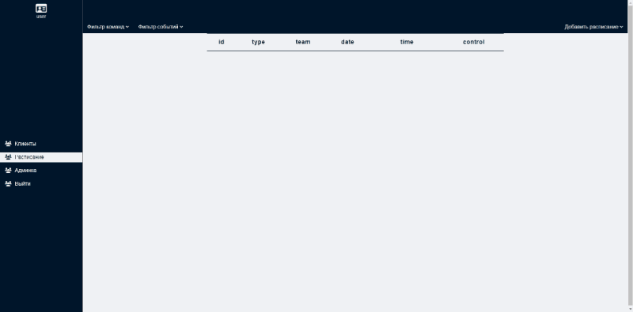
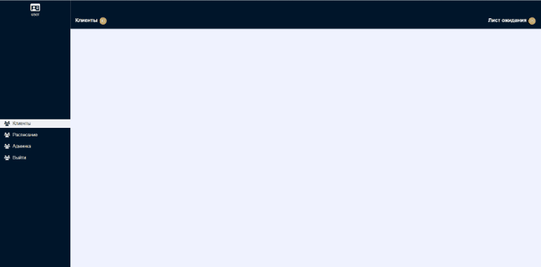

WowVendorTeamHelper
=========================
Внутренний сервис для обработки заказов, которые поступают из корпоративной среды Slack, организует
их хранение и позволяет управлять жизненным циклом каждого заказа. В приложении есть возможность
добавления расписания, в которые могут быть определены заказы на выполнение. Также сервис позволяет
информировать заказчиков о выполнении заказа или о форс-мажорных ситуациях и команды исполнителей о
списке клиентов на конкретное событие с помощью взаимодействия оператора и приложения.

Цель
=========================

Сервис должен быть доступен в браузере через интернет.

Сервис должен иметь / уметь:

* Регистрировать / Авторизовывать пользователей.
* Администрировать пользователей и их роли. (Подтверждение / отклонение заявки на регистрацию. Удаление пользователей.
  Назначение ролей и привилегий пользователям)
* Принимать сообщения из корпоративной среды Slack.
* Узнавать дополнительную информацию о клиенте с помощью Blizzard Api.
* Хранить информацию о заказах.
* Создавать расписание событий, в которые можно определить клиентов.
* Графический интерфейс

Технологический стек
=========================

* Java 11
* Spring boot
* Liquibase
* Docker
* Hibernate
* Postgresql
* Redis
* Spring Security
* JWT
* OAuth2
* Spring mail
* Bolt-servlets
* AngularJS
* JS
* HTML5
* CSS
* WebSocket

Запуск приложения
=========================

Перед запуском приложения необходимо интегрироваться с 2-мя внешними сервисами: Slack API и Blizzard API

Интеграция с Blizzard
==================
На данный момент она полностью встроена в приложение поэтому дополнительных действий не требуется.

Интеграция со Slack
=========================

1. Создать новое Slack приложение

- Зайдите в Slack API [App Dashboard](https://api.slack.com/) и нажмите на "Create New App".
- Задайте имя и выберите рабочее пространство для приложения. Если у вас нет рабочего простанстава вы можете создать
  [тут](https://slack.com/get-started#/createnew)
- Нажмите "Create App"

2. Настроить разрешения для приложения

- На странице приложения выберите "OAuth & Permissions" в меню слева.
- 
Добавьте необходимые разрешения для вашего приложения в частности :

channels:history
channels:read
chat:write
groups:history
groups:read
im:read
mpim:read

- Нажмите "Install App to Workspace" и следуйте инструкциям, чтобы установить приложение в рабочем пространстве.

3. Получить API ключ и секретный ключ

- На старнице приложения выберите "OAuth & Permissions" в меню слева и скопируйте значение Bot User OAuth Token
- На странице приложения выберите "Basic Information" в меню слева и скопируйте значение Signing Secret.

Эти данные занесите в переменные окружения

SLACK_BOT_TOKEN: `${YOUR_TOKEN}`

SLACK_SIGNING_SECRET: `${YOUR_SIGNING_SECRET}`

4. Настроить вебхук

- На странице приложения выберите "Event Subscriptions" в меню слева.
- Проверьте что вы подписаны на события указанные ниже. Если вы не подписаны - добавьте их вручную.

message.channels
message.groups

- Далее вам необходимо указал общедоступный URL-адрес приложения, сделать это можно
  через [ngrok](https://dashboard.ngrok.com/get-started/setup)

- После скачивания [ngrok](https://dashboard.ngrok.com/get-started/setup) и регистрации запустите его из командной
  строки

`ngrok http 3100`

- Скопируйте строчку `https://$your-url.eu.ngrok.io` и вставьте поле Request URL на странице Event Subscriptions и добавьте
  энд-поинт slack/events

  `https://$your-url.eu.ngrok.io/slack/events`

- Нажмите "Save Changes". Обратите внимание что ваше приложение на момент включения подписки на события должно быть 
 запущено, в противном случае вы получете ошибку и не сможете сохранить изменения.

Запуск приложения
====================
Скомпилируйте приложение и запустите JAR файл.

`mvn package`

`java -jar target/WowVendorTeamHelper-0.0.1-SNAPSHOT.jar`

Основные возможности представлены в виде gif изображений.
=============================
### Регистрация

### Авторизация

### Расписание 

### Формарование заказов
